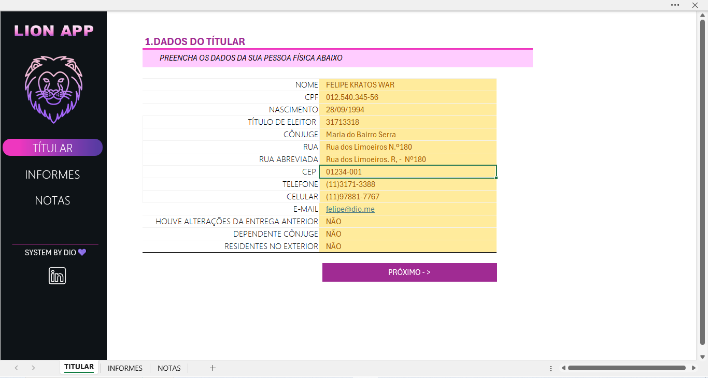
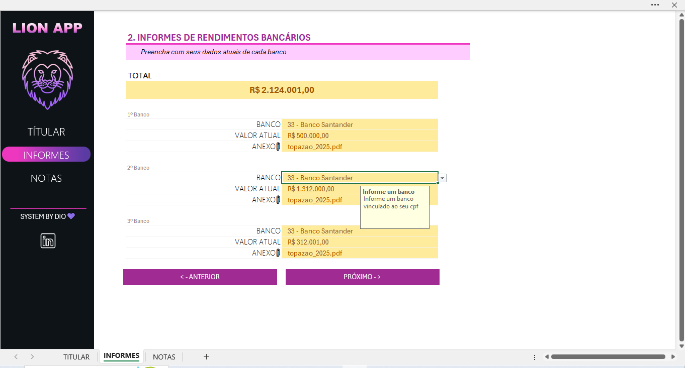
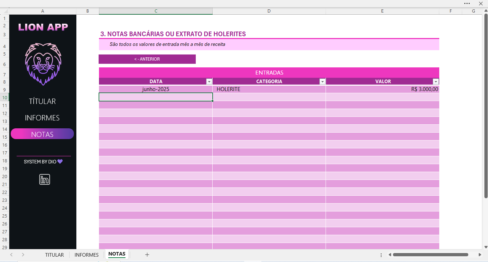

# 📊 Projeto DIO - Análise de Imposto de Receita

Este projeto faz parte do bootcamp da DIO (Digital Innovation One) e tem como objetivo simular o preenchimento e organização de dados para declaração de imposto de renda de forma prática e visual usando planilhas do Excel.

## 🧾 Objetivo

Criar um modelo funcional para análise e preenchimento de dados de pessoa física relacionados ao Imposto de Renda, aplicando boas práticas de organização de dados.

## 📁 Estrutura do Projeto

## 📌 Tecnologias Utilizadas

- Microsoft Excel
- Ferramentas de produtividade da DIO

## ✅ Funcionalidades

- Coleta e preenchimento de dados pessoais e financeiros
- Organização dos dados para entrega da declaração
- Simulação da entrega e verificação de campos obrigatórios

## 🖼️ Interface do Projeto

#### 📌 Tela de Dados do Titular

#### 📌 Tela de Informes de Rendimento  

#### 📌 Tela de Notas Explicativas  

## 👨‍💻 Autor

**Kleiton Gonçalves**  

> Projeto educacional – sem fins comerciais. Criado com base no curso da [DIO](https://www.dio.me/).
